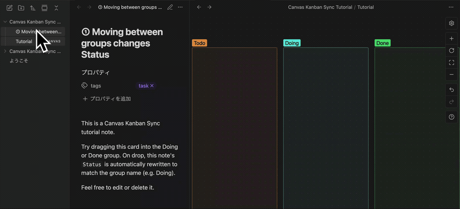
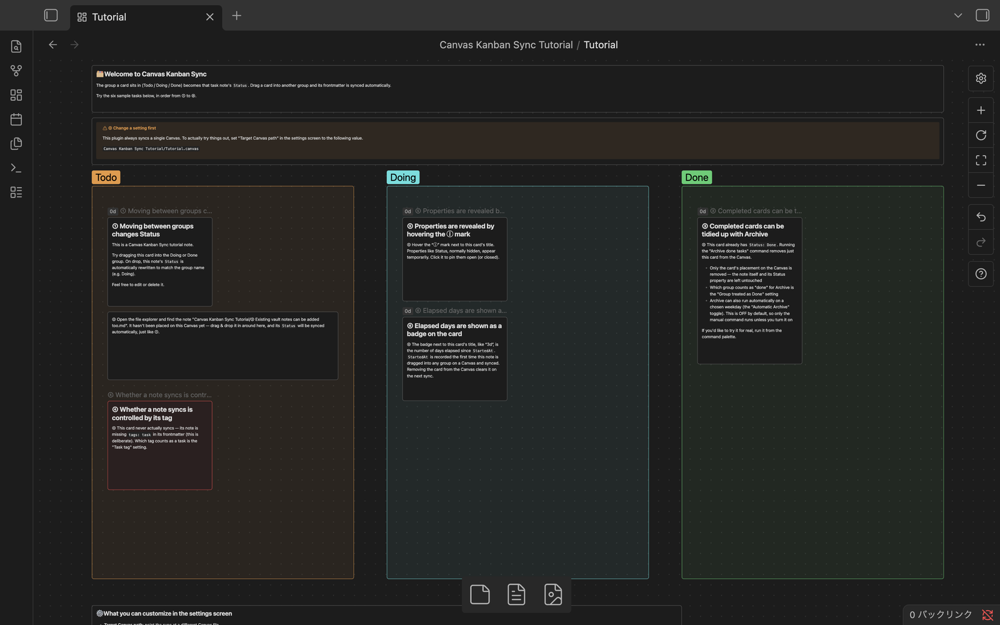
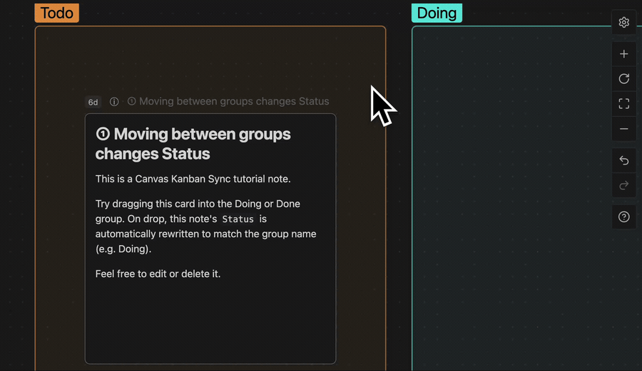
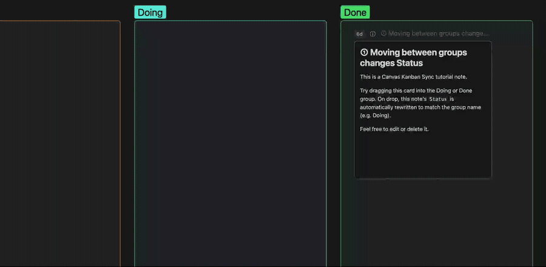

# Canvas Kanban Sync

A Kanban board on Obsidian Canvas that quietly tracks when each task started
and finished — so tasks stuck mid-flight don't stay invisible.

English | [日本語](README.ja.md)

---

## What is this?



*The wait between dropping the card and the Status property updating is shortened in this GIF for brevity — in practice it can take a bit longer.*

The name of the group a card sits in (Todo / Doing / Done, or whatever you
choose to call them) becomes that note's Status property. Just drag a card
between groups, and the note's frontmatter is updated automatically.

## Why I built this

I've relied on both Notion and FigJam for task management over the years.

- **Notion**: I managed tasks with an Agile mindset, logging start/completion
  dates to review progress. But it's database/list-shaped, so I couldn't
  freely spread my thinking out in two dimensions
- **FigJam**: I loved being able to place kanban cards freely across a 2D
  board. But with no tracking, tasks that got stuck mid-progress — started
  but never finished — would quietly disappear into the board

This plugin combines both. You get a free-form 2D Kanban board on Obsidian
Canvas, and moving a card automatically records when each task started and
finished. The elapsed-days badge exists specifically to surface tasks that
have stalled since they started.

Prioritizing or managing tasks isn't this plugin's job (I plan to hand that
off to AI eventually). It's only responsible for one thing: capturing the
data you need to notice what's stuck, with zero extra effort.

## Features

- Moving a card between Canvas groups automatically updates the note's Status property
- Group names are entirely up to you (not limited to Todo/Doing/Done)
- Archive feature to clear completed cards off the Canvas (manual, or automatic
  on a chosen weekday — automatic is OFF by default)
- Elapsed-days badge on each card, counted from when work started
- Customizable tag for which notes get synced
- Customizable property names for each auto-updated field (Status/StartedAt/
  ModifiedAt/CompletedAt). All but Status can be turned off
- Canvas card properties stay hidden by default — hover the ⓘ mark to reveal
  them temporarily (click to pin them open)

## Installation

Install from Community Plugins.

1. Settings → Community plugins → Browse
2. Search for "Canvas Kanban Sync" and install
3. Enable it

## Start using it

Run **Create task canvas** from the command palette to generate a Canvas with
empty Todo / Doing / Done groups at your chosen path (defaults to the vault
root). From there, just tag your task notes and place their cards.

## Try the tutorial

Before committing to your own vault, run **Create tutorial canvas (English)**
from the command palette to walk through the main features hands-on.

- A `Canvas Kanban Sync Tutorial` folder is created at the vault root,
  containing the Canvas and 6 sample notes — nothing else is added to the root
- Everything is self-contained inside the folder, so you can freely drag cards
  around and try the Archive command (it has no effect on your own production
  Canvas setup)
- When you're done, just delete the folder — no trace is left behind



## How it works

Moving a task note's card between groups on the target Canvas updates its
frontmatter like this (property names are configurable in settings):

```yaml
---
tags:
  - task
Status: Doing
StartedAt: 2026-09-06 10:00
ModifiedAt: 2026-09-06 10:00
---
```

- `Status`: which group the card is currently in — the group name, verbatim
- `StartedAt`: the time this task first left the resting state (Status unset)
  and was placed in a group. Starting point for the elapsed-days badge
- `ModifiedAt`: updated every time Status changes
- `CompletedAt`: the time the card entered the group treated as "done"



## About Archive

Clear completed task cards off the Canvas. Only their placement on the Canvas
is removed — the note itself and its Status property are left untouched.

- Manual: run "Archive done tasks" from the command palette
- Automatic: choose a weekday in settings to run it automatically each week
  (OFF by default)



## Settings

The settings screen lets you customize:

| Setting | What it does |
|---|---|
| Target Canvas path | Which Canvas file to sync |
| Task tag | Which tag marks a note as synced |
| Group treated as Done | Which group counts as "done" |
| Automatic Archive / Archive weekday | Enable/disable and schedule weekly Archive |
| Property used as Status / StartedAt / ModifiedAt / CompletedAt | Each property's name (all but Status can be left blank to turn it off) |

## Notes

Toggling the properties display on Canvas cards relies on Obsidian's internal
DOM structure. It may break after an Obsidian update.

## License

MIT

## Feedback

Please report bugs and feature requests via
[GitHub Issues](https://github.com/naotobando/canvas-kanban-sync/issues).
